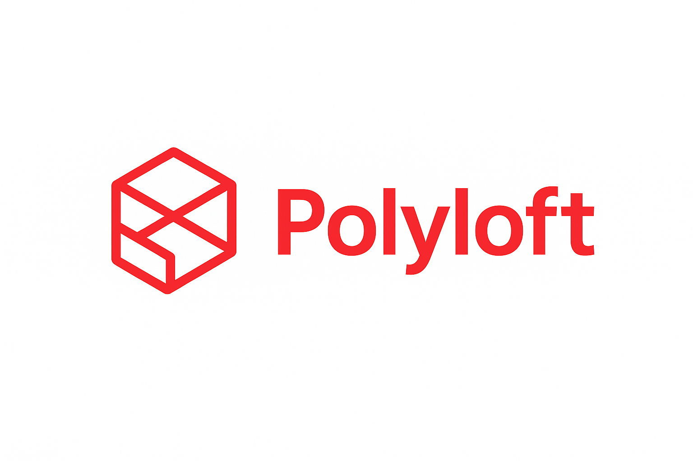

# Polyloft


[](https://deepwiki.com/ArubikU/polyloft)

Polyloft is a modular hybrid language combining object-oriented structure with scripting flexibility and reflection.

> **Polyloft — a language, a lot of ways.**  
> *The ilegal son of a lot of languages.*

**Polyloft** is a hybrid programming language that combines the expressiveness of Ruby, the simplicity of Python, and the performance of Java. It’s designed for teaching, experimentation, and creating powerful scripts without sacrificing clarity.


For complete branding guidelines, colors, and design assets, see [`public/polyloft_branding.md`](public/polyloft_branding.md).

Documentation (English): see `docs/` for the canonical language and stdlib guides.

## Installation

### Quick Install

#### Linux/macOS (Bash)

```bash
curl -fsSL https://raw.githubusercontent.com/ArubikU/polyloft/main/scripts/install.sh | bash
```

Or download and run the script:
```bash
wget https://raw.githubusercontent.com/ArubikU/polyloft/main/scripts/install.sh
chmod +x install.sh
./install.sh
```

#### Windows (PowerShell)

```powershell
irm https://raw.githubusercontent.com/ArubikU/polyloft/main/scripts/install.ps1 | iex
```

Or download and run:
```powershell
Invoke-WebRequest -Uri "https://raw.githubusercontent.com/ArubikU/polyloft/main/scripts/install.ps1" -OutFile "install.ps1"
.\install.ps1
```

### Manual Installation

#### Prerequisites

- **Go 1.22.0 or later**: Download from [go.dev/dl](https://go.dev/dl/)
- Verify Go is installed: `go version`

#### Install Polyloft

```bash
go install github.com/ArubikU/polyloft/cmd/polyloft@latest
```

#### Configure PATH

The `polyloft` binary will be installed in `$GOPATH/bin` (usually `~/go/bin` on Linux/macOS or `%USERPROFILE%\go\bin` on Windows).

**Linux/macOS (Bash/Zsh):**
```bash
echo 'export PATH="$PATH:$(go env GOPATH)/bin"' >> ~/.bashrc
source ~/.bashrc
```

**Windows (PowerShell):**
```powershell
[Environment]::SetEnvironmentVariable("Path", $env:Path + ";$env:USERPROFILE\go\bin", [EnvironmentVariableTarget]::User)
```

Then restart your terminal.

#### File Associations

- Windows scripts register `.pf` files to open with `polyloft run` and `.pfx` binaries to execute directly.
- The Windows installer also appends `.PFX` to `PATHEXT` so `myapp.pfx` runs like any other executable.
- Linux/macOS scripts create desktop and MIME entries so `.pf` and `.pfx` files launch via `polyloft`.

#### Verify Installation

```bash
polyloft version
```

### Update Polyloft

To update to the latest version:

#### Linux/macOS (Bash)

```bash
curl -fsSL https://raw.githubusercontent.com/ArubikU/polyloft/main/scripts/update.sh | bash
```

Or manually:
```bash
go install github.com/ArubikU/polyloft/cmd/polyloft@latest
```

#### Windows (PowerShell)

```powershell
irm https://raw.githubusercontent.com/ArubikU/polyloft/main/scripts/update.ps1 | iex
```

Or manually:
```powershell
go install github.com/ArubikU/polyloft/cmd/polyloft@latest
```

### Usage

Once installed, use Polyloft anywhere:

```bash
polyloft init                 # Initialize new project
polyloft install              # Install dependencies
polyloft build                # Build using default output (adds .pfx on Windows)
polyloft build -o app         # Build executable with custom name
polyloft run file.pf          # Run Polyloft file
polyloft run                  # Run current project (uses entry_point from polyloft.toml)
polyloft repl                 # Start REPL
polyloft search <query>       # Search for packages in registry
polyloft register             # Register new account on registry
polyloft login                # Authenticate with package registry
polyloft logout               # Clear authentication
polyloft publish              # Publish package to registry
polyloft generate-mappings    # Generate mappings.json for IDE/editor support
```

### IDE Support

**VSCode Extension:** Full language support with syntax highlighting, linting, auto-completion, and more!

```bash
# Install the extension (see vscode-extension/INSTALL.md for details)
cd vscode-extension
npm install && npm run compile
code --install-extension .

# Generate mappings for enhanced IntelliSense
polyloft generate-mappings
```

Features:
- Syntax highlighting for `.pf` files
- Real-time linting and error detection
- Intelligent auto-completion (keywords, built-ins, user symbols)
- Go to Definition and Hover information
- Multi-file support with import resolution

See [docs/vscode-extension.md](docs/vscode-extension.md) for complete documentation.

### Troubleshooting

**Problem**: `polyloft: command not found` after installation

**Solution**:
1. Verify Go is installed: `go version`
2. Check if binary exists:
   - Linux/macOS: `ls $(go env GOPATH)/bin/polyloft`
   - Windows: `Test-Path "$env:USERPROFILE\go\bin\polyloft.exe"`
3. Ensure `GOPATH/bin` is in your PATH (see Configure PATH above)
4. Restart your terminal after adding to PATH

**Problem**: Installation fails with "module not found"

**Solution**:
1. Check internet connection
2. Clear Go module cache: `go clean -modcache`
3. Try again: `go install github.com/ArubikU/polyloft/cmd/polyloft@latest`

For more issues, see [GitHub Issues](https://github.com/ArubikU/polyloft/issues).

### For Developers

This repository includes a small, extensible Go CLI to experiment with the Polyloft frontend/runtime. It's intentionally minimal and well-commented so it can grow with the language.

Quickstart for development:

- Build the CLI: `go build -o bin/polyloft ./cmd/polyloft`
- Run the REPL: `go run ./cmd/polyloft repl`
- Run a file: `go run ./cmd/polyloft run ./test.pf`
- Run current project: `go run ./cmd/polyloft run` (requires polyloft.toml)
- Install dependencies: `go run ./cmd/polyloft install` (requires polyloft.toml)
- Build executable: `go run ./cmd/polyloft build -o myapp` (requires polyloft.toml)
- Search packages: `go run ./cmd/polyloft search <query>`
- Authenticate: `go run ./cmd/polyloft login`
- Publish package: `go run ./cmd/polyloft publish` (requires polyloft.toml and authentication)
- Run registry server: `go run ./server/cmd/main.go -addr :8080`
- Run tests: `go test ./...`

## Package Registry

Polyloft includes a complete package registry system for sharing and discovering packages:

### Using the Registry

#### Searching for Packages

```bash
polyloft search vector
```

This searches the registry for packages matching "vector" in their name, author, or description.

#### Installing Packages

Packages can be specified with the `package@author` syntax:

```toml
[[dependencies.pf]]
name = "vectores@arubiku"
version = "1.0.0"
```

Then run:
```bash
polyloft install
```

For Go modules, use the standard format:
```bash
polyloft install github.com/arubiku/vectores
```

#### Publishing Packages

1. **Register an account**: `polyloft register`
   - Enter your username, email, and password
   - Account is created on the registry server

2. **Authenticate**: `polyloft login`
   - Enter your username and password
   - Credentials are stored securely in `~/.polyloft/credentials.json`

3. **Configure your package**: Ensure your `polyloft.toml` includes:
   ```toml
   [project]
   name = "my-package"
   version = "1.0.0"
   entry_point = "src/main.pf"
   ```

4. **Publish**: `polyloft publish`
   - Packages are automatically compressed (tar.gz)
   - Checksums are generated for integrity (SHA-256)
   - All `.pf` files are included
   - Package binaries are uploaded to the server

### Running the Registry Server

The package registry server is included and can be run locally:

```bash
cd server/cmd
go run main.go -addr :8080
```

Or build and run:
```bash
go build -o polyloft-server ./server/cmd
./polyloft-server -addr :8080
```

The server provides:
- User registration and authentication
- Package publishing with binary storage
- Package retrieval and download
- Package search
- RESTful API
- CORS support for web clients
- SHA-256 checksum verification

### Registry Configuration

Set the registry URL via environment variable:
```bash
export POLYLOFT_REGISTRY_URL="http://localhost:8080"
```

Default: `https://registry.polyloft.org`

For more details, see [server/README.md](server/README.md) for the registry infrastructure.

## Documentation

### User Documentation
- [Installation Guide](README.md#installation) - Install and update Polyloft
- [Usage Examples](README.md#usage) - Getting started with Polyloft
- [Package Registry](README.md#package-registry) - Publishing and using packages
- [Troubleshooting](README.md#troubleshooting) - Common issues and solutions
- [VSCode Extension](docs/vscode-extension.md) - IDE support with syntax highlighting, linting, and auto-completion

### Developer Documentation
- `docs/build-system.md` - Build and dependency management system
- `docs/vscode-extension.md` - VSCode extension features and development
- `server/README.md` - Package registry server infrastructure
- `ROADMAP.md` - Future features and development timeline
- `IMPLEMENTATION_SUMMARY.md` - Technical implementation details
- `PUBLISHING.md` - Release process for maintainers

Tip: `Sys.time()` returns an Int64 (ms since epoch). Use `Sys.time("float")` for Float.

Layout:

- `cmd/polyloft`: CLI entrypoint (repl/run/build/install/version/generate-mappings)
- `internal/ast`: AST building blocks
- `internal/lexer`: tokenizer stub
- `internal/parser`: parser stub
- `internal/engine`: execution/runtime stub
- `internal/repl`: simple line REPL
- `internal/version`: version metadata
- `internal/config`: TOML configuration parser
- `internal/builder`: executable builder
- `internal/installer`: dependency installer
- `internal/mappings`: mappings generator for IDE support
- `pkg/runtime`: public runtime API for built executables
- `vscode-extension`: VSCode extension for Polyloft language support
- `libs`: standard library packages
