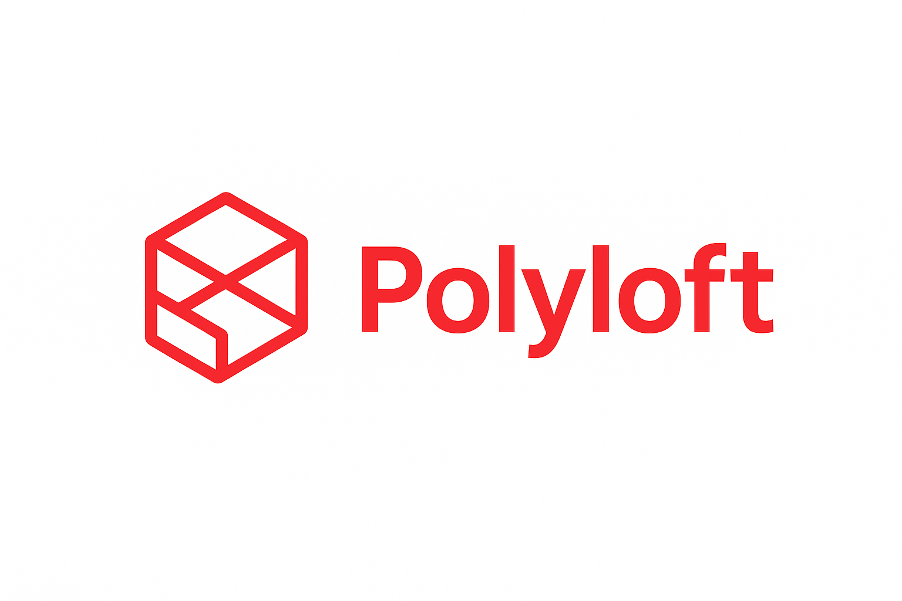

# Welcome to Polyloft



> **Polyloft — a language, a lot of ways.**  
> *The ilegal son of a lot of languages.*

Polyloft is a modern, hybrid programming language that combines the expressiveness of Ruby, the simplicity of Python, and the performance of Java. It's designed for teaching, experimentation, and creating powerful scripts without sacrificing clarity.

## What is Polyloft?

Polyloft is a modular hybrid language that combines:

- **Object-oriented structure** with classes, interfaces, and inheritance
- **Scripting flexibility** with dynamic typing when needed
- **Reflection capabilities** for metaprogramming
- **Modern concurrency** with async/await, channels, and threads
- **Strong type system** with generics, variance, and bounds
- **Clean syntax** inspired by the best features of Ruby, Python, and Java

## Key Features

### 🚀 Modern Language Features

- **Generics with variance**: Full support for generic types with `<T>`, `<? extends T>`, `<? super T>`, and variance annotations
- **Async/Await**: JavaScript-style promises and Java-style CompletableFutures
- **Channels**: Go-style channels for concurrent communication
- **Pattern matching**: Powerful pattern matching with select statements
- **Annotations**: Decorator-style annotations for metaprogramming

### 💎 Clean and Expressive Syntax

```polyloft
// Simple and readable
class Person:
    Person(name: String, age: Int):
        this.name = name
        this.age = age
    end
    
    def greet():
        println("Hello, I'm #{this.name}!")
    end
end

let person = Person("Alice", 30)
person.greet()
```

### 🛠️ Rich Standard Library

- **Math**: Comprehensive mathematical functions and constants
- **Sys**: System operations, timing, and randomness
- **IO**: File operations, reading, writing, and streaming
- **Net**: Network programming with TCP sockets
- **Collections**: Generic List, Set, Map, and Deque with rich methods

### 📦 Package Management

- Built-in package registry for sharing and discovering libraries
- Simple dependency management with `polyloft.toml`
- Support for both Polyloft and Go packages
- Easy publishing with `polyloft publish`

### 🔧 Developer Tools

- **REPL**: Interactive shell for experimentation
- **VSCode Extension**: Full IDE support with syntax highlighting, linting, and auto-completion
- **Build System**: Compile to native executables
- **Cross-platform**: Works on Linux, macOS, and Windows

## Quick Example

```polyloft
// Fibonacci with memoization
def fibonacci(n: Int) -> Int:
    if n <= 1:
        return n
    end
    return fibonacci(n - 1) + fibonacci(n - 2)
end

// List comprehension style
let numbers = [1, 2, 3, 4, 5]
let doubled = numbers.map((x: Int) -> Int => x * 2)
println(doubled)  // [2, 4, 6, 8, 10]

// Async operations with Promises
let fetchData = () => do
    return Promise((resolve, reject) => do
        let result = someAsyncOperation()
        resolve(result)
    end)
end

fetchData().then((result) => do
    println("Result: #{result}")
end)
```

## Philosophy

Polyloft is designed with these principles:

1. **Clarity over cleverness**: Code should be easy to read and understand
2. **Safety with flexibility**: Strong typing when needed, dynamic when helpful
3. **Modern features**: Embrace contemporary programming patterns
4. **Educational**: Great for learning programming concepts
5. **Practical**: Suitable for real-world applications

## Use Cases

- **Learning Programming**: Clear syntax perfect for beginners
- **Scripting**: Quick automation and system administration tasks
- **Algorithm Development**: Clean syntax for implementing algorithms
- **Web Services**: Built-in networking support for servers
- **Concurrent Applications**: Modern concurrency primitives
- **Experimentation**: REPL and dynamic features for rapid prototyping

## Community

- **GitHub**: [ArubikU/polyloft](https://github.com/ArubikU/polyloft)
- **Issues**: Report bugs and request features
- **Discussions**: Ask questions and share projects
- **Contributing**: See our [Contributing Guide](contributing/development.md)

## License

Polyloft is open source software. See the LICENSE file for details.

---

Ready to get started? Head to [Getting Started](getting-started.md) or [Installation](installation.md)!

## Documentation Structure

This documentation is organized into several sections:

### For Beginners
- **[Getting Started](getting-started.md)** - Your first Polyloft program
- **[Installation](installation.md)** - Installing Polyloft on your system
- **[Basic Syntax](language/syntax.md)** - Learn the language basics

### Language Reference
- **[Language Overview](language/overview.md)** - Complete language introduction
- **[Generics](language/generics.md)** - Type-safe generic programming
- **[Classes and Objects](language/classes-and-objects.md)** - Object-oriented programming

### Standard Library
- **[Math Module](stdlib/math.md)** - Mathematical functions
- **[Sys Module](stdlib/sys.md)** - System operations
- **[IO Module](stdlib/io.md)** - File and directory operations
- **[Net Module](stdlib/net.md)** - Network programming

### Concurrency
- **[Concurrency Overview](concurrency/overview.md)** - Concurrent programming
- **[Channels](concurrency/channels.md)** - Message passing
- **[Async/Await](concurrency/async-await.md)** - Asynchronous operations

### Tools
- **[CLI Overview](cli/overview.md)** - Command-line tools
- **[REPL](cli/repl.md)** - Interactive shell
- **[Building](cli/build.md)** - Creating executables

## Quick Links

- 📚 [Full Table of Contents](SUMMARY.md)
- 🚀 [Getting Started Guide](getting-started.md)
- 💻 [Language Syntax](language/syntax.md)
- 📦 [Standard Library](stdlib/overview.md)
- ⚡ [Concurrency](concurrency/overview.md)
- 🔧 [CLI Tools](cli/overview.md)

## Viewing Documentation

### Online
Visit the documentation website (once deployed to GitHub Pages):
```
https://arubiku.github.io/polyloft/
```

### Locally with GitBook
```bash
cd polyloft
npm install -g gitbook-cli
gitbook install
gitbook serve
# Open http://localhost:4000
```

### As Markdown
All documentation files are standard Markdown and can be read directly on GitHub or with any Markdown viewer.

## Contributing

Found an error or want to improve the documentation? See our [Contributing Guide](contributing/development.md) or open an issue on GitHub.

---

**Ready to start?** Head to [Getting Started](getting-started.md)!
